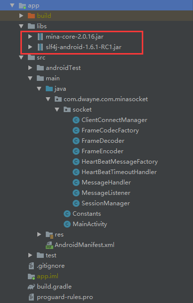

### 基于Apache Mina框架实现Android Socket长连接通信

#### 前言

Socket长连接是Android开发中很基础的功能，很多的App都会用到这个功能，实现的方式有很多，我今天就只写基于Apache Mina框架的实现方式，至于TCP/IP协议相关的知识就不涉及了，想了解更多关于Socket长连接知识的，可以去看看[刚哥的文章](https://juejin.im/post/5b3649d751882552f052703b)，本文内容会同步至我的[CSDN博客](https://blog.csdn.net/u012987393)

#### Apache Mina介绍

[Mina](http://mina.apache.org/)是一个基于NIO的网络框架，使用它编写程序时，可以专注于业务处理，而不用过于关心IO操作。不论应用程序采用什么协议（TCP、UDP）或者其它的，Mina提供了一套公用的接口，来支持这些协议。目前可以处理的协议有：HTTP, XML, TCP, LDAP, DHCP, NTP, DNS, XMPP, SSH, FTP… 。从这一点来说，Mina不仅仅是一个基于NIO的框架，更是一个网络层协议的实现。

#### 基于Mina实现Socket长连接

##### 1. 先添加相关依赖Jar包

##### 

##### 2. 客户端代码

添加相关编码协议，日志，设置心跳和Handler

```java
NioSocketConnector mSocketConnector = new NioSocketConnector();

//                mSocketConnector.setConnectTimeoutMillis(Constants.TIMEOUT);

                //设置协议封装解析处理
                mSocketConnector.getFilterChain().addLast("protocol", new ProtocolCodecFilter(new FrameCodecFactory()));
                // 设置日志输出工厂
                mSocketConnector.getFilterChain().addLast("logger", new LoggingFilter());

                //设置心跳包
                /*KeepAliveFilter heartFilter = new KeepAliveFilter(new HeartBeatMessageFactory());
                //每 1 分钟发送一个心跳包
                heartFilter.setRequestInterval(1 * 60);
                //心跳包超时时间 10s
                heartFilter.setRequestTimeout(10);
//                heartFilter.setRequestTimeoutHandler(new HeartBeatTimeoutHandler());
                mSocketConnector.getFilterChain().addLast("heartbeat", heartFilter);*/

                //设置 handler 处理业务逻辑
                mSocketConnector.setHandler(new MessageHandler(context));
                mSocketConnector.addListener(new MessageListener(mSocketConnector));

                // 设置接收和发送缓冲区大小
                mSocketConnector.getSessionConfig().setReceiveBufferSize(1024);
//                mSocketConnector.getSessionConfig().setSendBufferSize(1024);
                // 设置读取空闲时间：单位为s
                mSocketConnector.getSessionConfig().setReaderIdleTime(60);


                //配置服务器地址
                InetSocketAddress mSocketAddress = new InetSocketAddress(Constants.HOST, Constants.PORT);
                //发起连接
                ConnectFuture mFuture = mSocketConnector.connect(mSocketAddress);
```

断线重连处理，有一点不同，mSocketConnector在添加相关协议的时候，要先判断

```java
int count = 0;// 记录尝试重连的次数
                NioSocketConnector mSocketConnector = null;
                while (!isRepeat[0] && count < 10) {
                    try {
                        count++;
                        if (mSocketConnector == null) {
                            mSocketConnector = new NioSocketConnector();
                        }

//                        mSocketConnector.setConnectTimeoutMillis(Constants.TIMEOUT);

                        if (!mSocketConnector.getFilterChain().contains("protocol")) {
                            //设置协议封装解析处理
                            mSocketConnector.getFilterChain().addLast("protocol", new ProtocolCodecFilter(new FrameCodecFactory()));
                        }

                        if (!mSocketConnector.getFilterChain().contains("logger")) {
                            // 设置日志输出工厂
                            mSocketConnector.getFilterChain().addLast("logger", new LoggingFilter());
                        }

                        /*if (!mSocketConnector.getFilterChain().contains("heartbeat")) {
                            //设置心跳包
                            KeepAliveFilter heartFilter = new KeepAliveFilter(new HeartBeatMessageFactory());
                            //每 1 分钟发送一个心跳包
                            heartFilter.setRequestInterval(1 * 60);
                            //心跳包超时时间 10s
                            heartFilter.setRequestTimeout(10);
//                            heartFilter.setRequestTimeoutHandler(new HeartBeatTimeoutHandler());
                            mSocketConnector.getFilterChain().addLast("heartbeat", heartFilter);
                        }*/

                        //设置 handler 处理业务逻辑
                        mSocketConnector.setHandler(new MessageHandler(context));
                        mSocketConnector.addListener(new MessageListener(mSocketConnector));

                        // 设置接收和发送缓冲区大小
                        mSocketConnector.getSessionConfig().setReceiveBufferSize(1024);
//                        mSocketConnector.getSessionConfig().setSendBufferSize(1024);
                        // 设置读取空闲时间：单位为s
                        mSocketConnector.getSessionConfig().setReaderIdleTime(60);

                        //配置服务器地址
                        InetSocketAddress mSocketAddress = new InetSocketAddress(Constants.HOST, Constants.PORT);
                        //发起连接
                        ConnectFuture mFuture = mSocketConnector.connect(mSocketAddress);
                        mFuture.awaitUninterruptibly();
                        IoSession mSession = mFuture.getSession();
                        if (mSession.isConnected()) {
                            isRepeat[0] = true;
                            e.onNext(mSession);
                            e.onComplete();
                            break;
                        }
                    } catch (Exception e1) {
                        e1.printStackTrace();
                        if (count == Constants.REPEAT_TIME) {
                            System.out.println(Constants.stringNowTime() + " : 断线重连"
                                    + Constants.REPEAT_TIME + "次之后仍然未成功,结束重连.....");
                            break;
                        } else {
                            System.out.println(Constants.stringNowTime() + " : 本次断线重连失败,5s后进行第" + (count + 1) + "次重连.....");
                            try {
                                Thread.sleep(5000);
                                System.out.println(Constants.stringNowTime() + " : 开始第" + (count + 1) + "次重连.....");
                            } catch (InterruptedException e12) {
                            }
                        }
                    }

                }
```


编码，解码协议，根据实际情况而定

```java
public class FrameDecoder extends CumulativeProtocolDecoder {


    private final static Charset charset = Charset.forName("UTF-8");

    @Override
    protected boolean doDecode(IoSession ioSession, IoBuffer ioBuffer, ProtocolDecoderOutput protocolDecoderOutput) throws Exception {

        //数据粘包，断包处理
        int startPosition = ioBuffer.position();
        while (ioBuffer.hasRemaining()) {
            byte b = ioBuffer.get();
            if (b == '\n') {//读取到\n时候认为一行已经读取完毕
                int currentPosition = ioBuffer.position();
                int limit = ioBuffer.limit();
                ioBuffer.position(startPosition);
                ioBuffer.limit(limit);
                IoBuffer buffer = ioBuffer.slice();
                byte[] bytes = new byte[buffer.limit()];
                buffer.get(bytes);
                String message = new String(bytes, charset);
                protocolDecoderOutput.write(message);
                ioBuffer.position(currentPosition);
                ioBuffer.limit(limit);
                return true;
            }
        }
        ioBuffer.position(startPosition);
        return false;

    }
}
```


```java
public class FrameEncoder implements ProtocolEncoder {
    private final static Charset charset = Charset.forName("UTF-8");
    @Override
    public void encode(IoSession ioSession, Object message, ProtocolEncoderOutput protocolEncoderOutput) throws Exception {
        IoBuffer buff = IoBuffer.allocate(100).setAutoExpand(true);
        buff.putString(message.toString(), charset.newEncoder());
        // put 当前系统默认换行符 WINDOWS：\r\n, Linux:\n
        buff.putString(LineDelimiter.WINDOWS.getValue(), charset.newEncoder());
        // 为下一次读取数据做准备
        buff.flip();
        protocolEncoderOutput.write(buff);
    }

    @Override
    public void dispose(IoSession ioSession) throws Exception {

    }
}
```

心跳包处理，Android设备加心跳并不能完成保持长连接的状态，毕竟保活你懂哒！

```java
public class HeartBeatMessageFactory implements KeepAliveMessageFactory {

    @Override
    public boolean isRequest(IoSession ioSession, Object message) {
        //如果是客户端主动向服务器发起的心跳包, return true, 该框架会发送 getRequest() 方法返回的心跳包内容.

        if(message instanceof String && message.equals(Constants.PING_MESSAGE)){
            return true;
        }
        return false;

    }

    @Override
    public boolean isResponse(IoSession ioSession, Object message) {
        //如果是服务器发送过来的心跳包, return true后会在 getResponse() 方法中处理心跳包.

        if(message instanceof String && message.equals(Constants.PONG_MESSAGE)){
            return true;
        }
        return false;
    }
    
    @Override
    public Object getRequest(IoSession ioSession) {
        //自定义向服务器发送的心跳包内容.
        return Constants.PING_MESSAGE;
    }

    @Override
    public Object getResponse(IoSession ioSession, Object message) {
        //自定义解析服务器发送过来的心跳包.
        return Constants.PONG_MESSAGE;
    }
}
```


